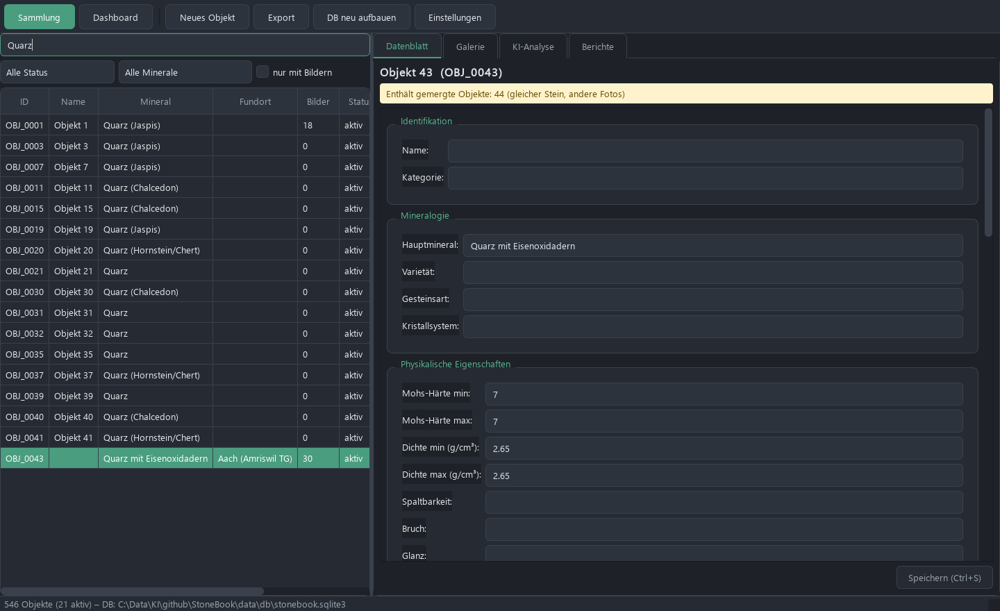
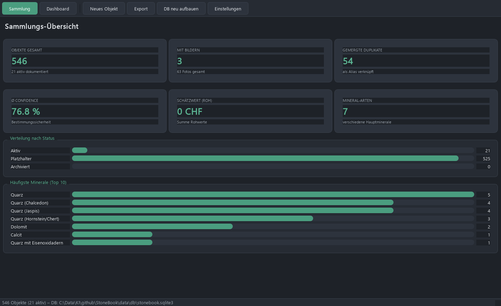
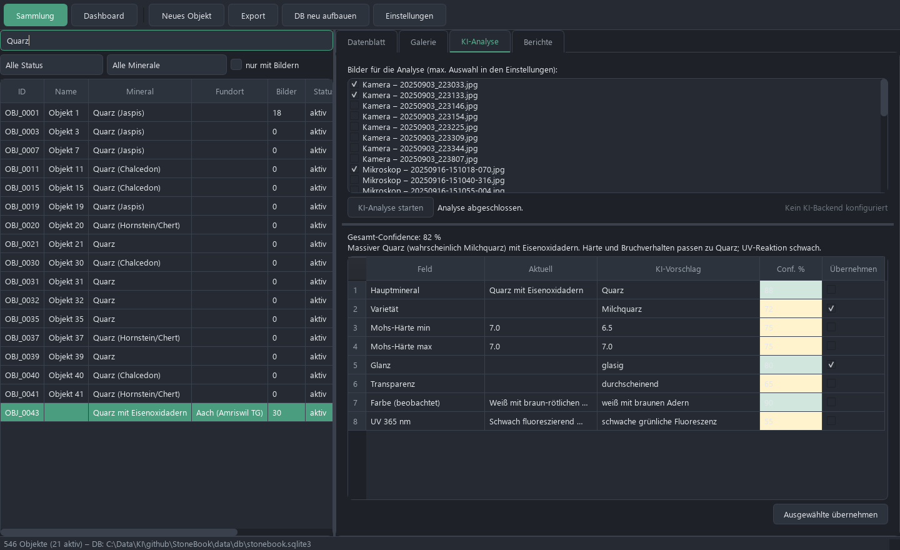
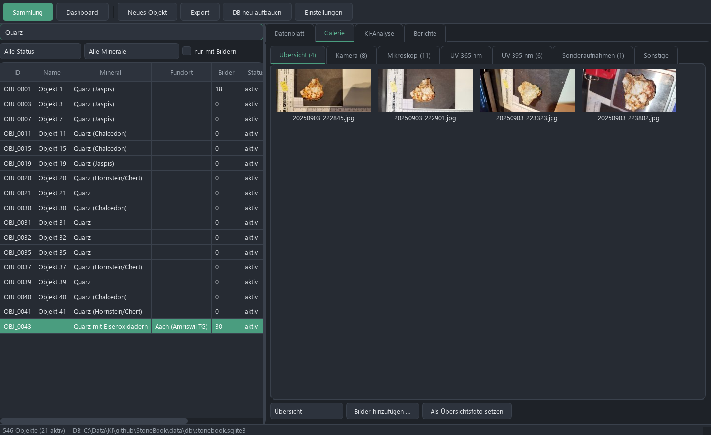

<div align="center">

# 🪨 StoneBook V3

**Offline-Verwaltung für eine Gesteins- & Mineraliensammlung — mit KI-gestützter Bestimmung**

[](#)
[](#)
[](#)
[](#)
[](#)
[](#)

</div>

---

StoneBook ist eine vollständig **offline** lauffähige Desktop-App zur Dokumentation einer
privaten Gesteins- und Mineraliensammlung (Region St. Gallen, Schweiz). Sie verwaltet
Objekte mit Fotos (Tageslicht, Mikroskop, UV 365/395 nm), erfasst 43 standardisierte
mineralogische Felder und unterstützt die Bestimmung per **KI-Bildanalyse** — wahlweise über
die **Claude-Cloud** oder ein **lokales Modell** (Ollama, Open-WebUI, LM Studio, KI-Core).

## 📸 Screenshots

| Sammlung & Datenblatt | Dashboard |
|---|---|
|  |  |

| KI-Analyse | Galerie |
|---|---|
|  |  |

## ✨ Funktionen

- **📇 Objektdatenbank** — 43 Standardfelder (Mineralogie, physikalische Tests, UV/Reaktionen,
  Maße, Bewertung), Volltextsuche (SQLite FTS5), Filter nach Status / Mineral / „nur mit Bildern".
- **🖼️ Bildergalerie** — pro Objekt nach Kategorie (Übersicht, Kamera, Mikroskop, UV 365/395 nm,
  Sonderaufnahmen), Thumbnail-Cache, Vollbild-Zoom, Drag-freies Hinzufügen.
- **🤖 KI-Analyse** — Fotos + vorhandene Daten an ein Vision-Modell senden; strukturierte
  Vorschläge je Feld **mit Confidence-Wert** und Begründung, selektiv übernehmbar.
  Backend frei wählbar: **Claude** oder **lokales Modell**.
- **📊 Dashboard** — Kennzahlen (Objekte, Bilder, gemergte Duplikate, Ø Confidence, Schätzwert)
  und Verteilungen (Status, häufigste Minerale).
- **➕ Neues-Objekt-Assistent** — Bilder aus einem Quellordner automatisch kategorisieren
  (Dateinamen-Erkennung + EXIF-Datum), Ordnerstruktur anlegen.
- **📤 Export** — CSV (44 Spalten, Excel-tauglich), JSON-Vollbackup, DOCX-Analysebericht je Objekt.
- **🔗 Duplikat-Merge** — ~30 dokumentierte Duplikat-Gruppen (gleicher Stein, andere Fotos)
  werden bei der Migration automatisch zusammengeführt; alte IDs bleiben als Alias erhalten.

## 🚀 Schnellstart

```bash
cd app
pip install -r requirements.txt
python -m stonebook.migration.migrate   # Datenbank aus den Repo-Quellen aufbauen
python -m stonebook                      # GUI starten
```

Die App erkennt den Repo-Ordner automatisch (Verzeichnis mit `objects/` und `data/`).

## 🤖 KI-Backend einrichten

Unter **Einstellungen** das Backend wählen:

| Backend | Beispiel-Konfiguration | Hinweis |
|---|---|---|
| **Claude (Cloud)** | API-Key `sk-ant-…`, Modell `claude-sonnet-4-6` / `claude-opus-4-7` | Höchste Qualität |
| **Ollama (lokal)** | `http://localhost:11434/v1`, Modell `gemma3:27b` | Komplett offline |
| **Open-WebUI** | `http://<host>:3000/api` + API-Key | z.B. auf KI-Core |
| **LM Studio** | `http://localhost:1234/v1` | |
| **OpenClaw-Gateway / KI-Core** | `http://<host>:18789/v1` + Bearer-Token | Eigene Node-Infrastruktur |

> Für die Bildanalyse ist ein **vision-fähiges** Modell nötig
> (z.B. `gemma3`, `llava`, `qwen2.5-vl`, `llama3.2-vision`).
> Keys werden im **Windows Credential Manager** gespeichert, niemals im Repo.
> Der Button **„Verbindung testen"** prüft den lokalen Endpunkt.

Details: [docs/AI_BACKENDS.md](docs/AI_BACKENDS.md)

## 🏗️ Architektur

```
app/stonebook/
├── fields.py          # 43 Standardfelder (Single Source of Truth)
├── db/                # SQLite-Schema, Verbindung, Repositories (+ FTS5)
├── migration/         # CSV-Loader, ID-Normalisierung, Duplikat-Merge, Bildindex
├── gui/               # Hauptfenster, Liste, Datenblatt, Galerie, Dashboard, Theme
├── ai/                # Provider (Claude + OpenAI-kompatibel), Bildaufbereitung, Schema
└── export/            # CSV, JSON, DOCX
```

- **Single Source of Truth:** Die SQLite-DB (`data/db/`, nicht versioniert) ist jederzeit
  per `migrate` aus den CSV-Quellen reproduzierbar. Versioniert wird der CSV-Export.
- **Daten bleiben am Ort:** Bilder verbleiben unter `objects/OBJ_xxxx/<Kategorie>/`; die DB
  speichert nur relative Pfade.

## 📦 Build (EXE + Installer)

```bash
pip install pyinstaller
cd app
pyinstaller build/stonebook.spec --noconfirm --distpath build/dist
# anschließend build/installer.iss mit Inno Setup → StoneBook_V3_Setup.exe
```

## 🧪 Tests

```bash
cd app && pytest tests -q        # 30 Tests: Migration, CSV-Parser, Duplikate, Export, KI-Parser, Statistik
```

## 📂 Repo-Struktur

| Ordner | Inhalt |
|---|---|
| `app/` | Die StoneBook-V3-Anwendung |
| `objects/` | 600 Objektordner mit Fotos |
| `data/csv/` | Quelldaten + Exporte |
| `docs/` | Screenshots, Doku, Chat-Exports |
| `meta/` | SHA256-Manifest, Pfad-Mapping |
| `legacy/` | Original-Archiv |

---

<div align="center">
<sub>Privates Projekt · © G4MEOVER</sub>
</div>
